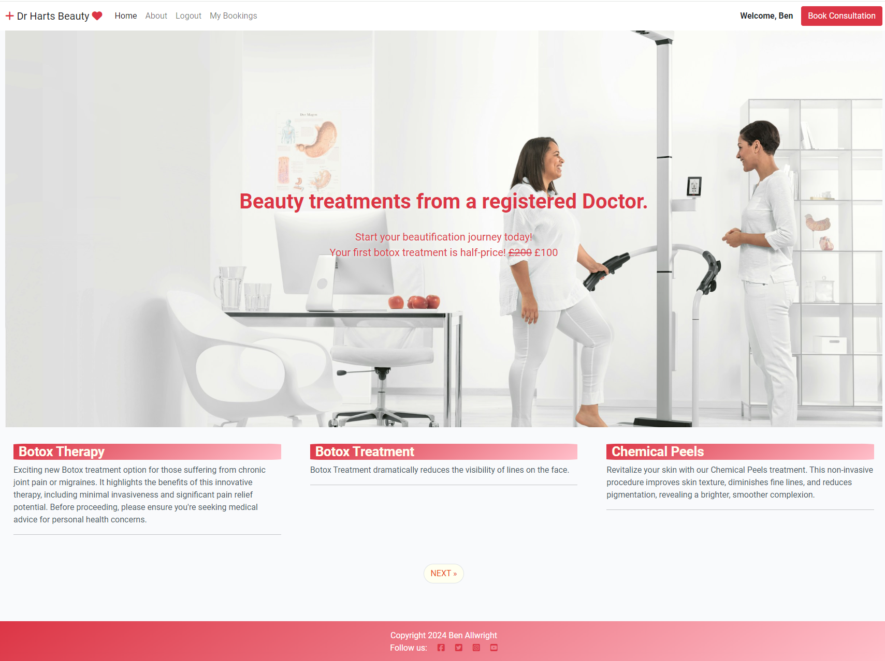
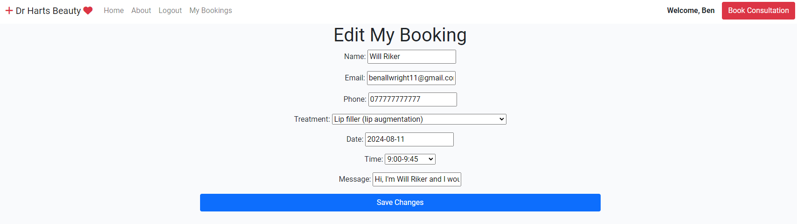

# Harts Beauty

## Features

Web application has the following pages:
- home page
- about page
- Treatment detail page
- login page
- registration page
- logout page
- make booking page
- booking confirmation page
- my bookings page
- Edit booking page

### Access to pages according to the login status:

| Page Name         | Logged in      | Not Logged In| 
| -------------     | ------------- | -------------| 
| home page         | Y             | Y            |
| about page        | Y             | Y            |
| login page        | Y             | Y            |
| registration page | Y             | Y            |
| logout page       | Y             | N            |
| make booking page | Y             | N            |
| my bookings page  | Y             | N            |
| edit booking page | Y             | N            |

**Navbar**

Navbar has the following links:
- logo (home page)
- home page
- about page
- register page
- login page

- The navbar also has a book online button that will direct the user to login or create an account if they are not logged in, but will take them to the booking page if they are logged in.

- on mobile the navbar menu becomes a button

- The menu button openn up like this

**Navbar when user is logged in**

- logout
- my bookings
- book consultation

**Footer**

Footer has the following sections:
- copytight
- social media links

For the mobile version of the website, the footer looks as follows:

  

**Home page**

  - The home page features a large image of a clinic with a central message

  

  - at the bottom of the home page is a paginated list of available treatments

  

**About**

- About page feature information about the site owner

**Signup page**

- The sign up page features the options to login or signup requiring username, email and password

**Login page**

- The login page features the option to login requiring username and password

**Logout page**

- The logout page features the option to logout

**Make a booking page**

- The Booking page features a form to create a booking. User needs to enter:
  - Full name
  - Treatment (Choice)
  - Date (Choice)
  - Time (Choice)
  - Phone number
  - Message (optional)

**Booking confirmation page**

- The booking confirmation page features a success message for the user and a link to see their bookings.

**My booking page**

- The my bookings page features:
  - A table with all the bookings for the logged in user
  - an option to edit their booking
  - an opttion to delete their booking

**Edit my booking page**

- The Edit my booking page gives users the ability to change the details of their booking.

