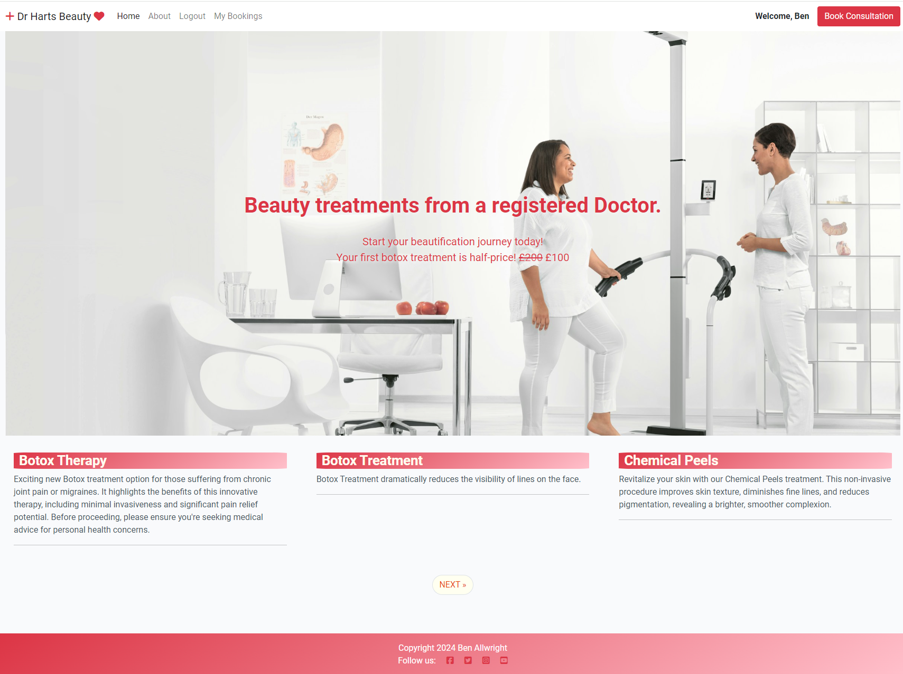
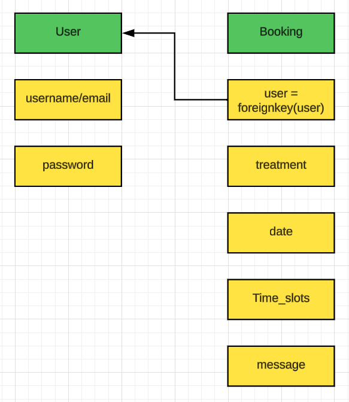

# Dr Harts Beauty

Live Version: [Dr Harts Beauty](https://beauty-treatments-2d7074a7a100.herokuapp.com)

Repository: [GitHub Repo](https://github.com/Allwrightben/harts-beauty-treatments)

The app is developed by [Ben Allwright](https://github.com/Allwrightben).



## About

[Dr Harts Beauty](https://beauty-treatments-2d7074a7a100.herokuapp.com) is a web app that gives information about the various treatments that Dr Hart can provide. The main goal of the app is to give site visitors the ability to browse treatments and encourage them to book a video consultation with the view to booking an actual treatment. Site vistors can create an account, book video appoinments and view, edit and delete their appointments.

## User Experience Design

### Strategy

Developed for a real doctor that wants to set up her own business one day, the app is designed to be easy to use and intuitive. The main goal of the app is to give site visitors the ability to browse treatments and encourage them to book a video consultation with the view to booking an actual treatment. This has been achieved by the use of a simple and intuitive interface. As a final goal, the app is aimed at increasing the number of treatments the doctor does every month by offering a free video consulation.

### Target Audience

The app was developed for all people that are interested in or seeking beauty treatments or chronic pain relief. 
  * Interested in Beauty: people can easily navigate the site to find the treatment they are interested in and book a free video consultation.
  * Seeking pain relief: People that are suffering with chronic pain can find treatments for migraines or join pain and book a free video consultation. 

### User Stories

#### **First Time Visitor Goals**

* As a First Time Visitor, I want to be able to easily understand the main purpose of the app, so that I can learn more about this app.
* As a First Time Visitor, I want to be able to easily navigate through the app, so that I can find the content.
* As a First Time Visitor, I want to be able to register my account, so that I can learn the benefits of the app as a user.
* As a First Time Visitor, I want to be able to find the app useful, so that I can use it according to my needs.

#### **Frequent Visitor Goals**
* As a Frequent User, I want to be able to log in to my account, so that I can have a personal account.
* As a Frequent User, I want to be able to easily log in and log out, so that I can access my personal account information.
* As a Frequent User, I want to be able to easily view my bookings.
* As a Frequent User, I can be able to change my bookings or delete them, so that if I can't make them I can change them.

#### **Receptionists' Goals**

* As a receptionist, I want to be able to view bookings as they come in and call or email the customer to
confirm their appointment with a medical professional.

## Technologies used

- ### Languages:
    
    + [Python 3.12.4](https://docs.python.org/3/whatsnew/3.12.html): the primary language used to develop the server-side of the website.
    + [HTML](https://developer.mozilla.org/en-US/docs/Web/HTML): the markup language used to create the website.
    + [CSS](https://developer.mozilla.org/en-US/docs/Web/css): the styling language used to style the website.

- ### Frameworks and libraries:

    + [Django](https://www.djangoproject.com/): python framework used to create all the logic.

- ### Databases:
    + [PostgreSQL from Code Institute](https://dbs.ci-dbs.net/): The database used to store all the data.
    + [SQLite](https://www.sqlite.org/): was used as a development database.

- ### Other tools:

    + [Git](https://git-scm.com/): the version control system used to manage the code.
    + [Pip3](https://pypi.org/project/pip/): the package manager used to install the dependencies.
    + [Gunicorn](https://gunicorn.org/): the webserver used to run the website.
    + [Django-allauth](https://django-allauth.readthedocs.io/en/latest/): the authentication library used to create the user accounts.
    + [GitHub](https://github.com/): used to host the website's source code.
    + [VSCode](https://code.visualstudio.com/): the IDE used to develop the website.
    + [Chrome DevTools](https://developer.chrome.com/docs/devtools/open/): was used to debug the website.
    + [Font Awesome](https://fontawesome.com/): was used to create the icons used in the website.
    + [W3C Validator](https://validator.w3.org/): was used to validate HTML5 code for the website.
    + [W3C CSS validator](https://jigsaw.w3.org/css-validator/): was used to validate CSS code for the website.
    + [PEP8](https://pep8.org/): was used to validate Python code for the website.

## FEATURES

Please refer to the [FEATURES.md](FEATURES.md) file for all features-related documentation.

## Design

The design of the application is based on the Material Design principles.
The central theme of the application is the simplicity of use. Thus, all the components are designed to be easy to use. The minimalistic approach was used to create something meaningful without moving out of focus. The decision to implement white spaces was made as it helps to create a more pleasant user experience.

### Color Scheme

The color scheme is designed to be simple and consistant with only 3 main colors, red, white and pink.

### Imagery

Images were design to be warm and friendly and specific to the nature of the website.

All images were taken from [Unsplash](https://unsplash.com/) free section.

## Information Architecture

### Database

* The database was then migrated to PostgreSQL.

### Entity-Relationship Diagram

* The ERD was created using [lucidchart](https://www.lucidchart.com/).



### Data Modeling


Extends Allauth's User model.

| Name          | Database Key  | Field Type    | Validation |
| ------------- | ------------- | ------------- | ---------- |
| User          | user          | ForeignKey    |  User, on_delete=models.CASCADE    |
| Name          | name          | CharField     | max_length=100, default="Your Name"|
| Email         | email         | EmailField    |                                    |
| Phone         | phone         | CharField     | validators=[MaxLengthValidator(15), MinLengthValidator(10)]    |
| Treatment     | treatment     | IntegerField  | choices=TREATMENTS                 |
| Date          | date          | CharField     |                                    | 
| Time          | time          | IntegerField  | choices=TIME_SLOTS                 |
| Message       | message       | CharField     | max_length=255                     |
| Created at    | created_at    | DateTimeField | auto_now_add=True                  |

```Python
# Time slots
TIME_SLOTS = (
    (0, '9:00-9:45'),
    (1, '10:00-10:45'),
    (2, '11:00-11:45'),
    (3, '14:00-14:45'),
    (4, '15:00-15:45'),
    (5, '16:00-16:45'),
    (6, '17:00-17:45'),
    (7, '18:00-18:45'),
)

TREATMENTS = (
    (0, 'Botox Therapy(chronic pain relief)'),
    (1, 'Botox Treatment (wrinkle reduction/prevention)'),
    (2, 'Chemical Peel (skin rejuvenation)'),
    (3, 'Dermal Fillers (facce sculpting/wrinkle reduction)'),
    (4, 'Hyperhidrosis (excessive sweating treatment)'),
    (5, 'Lip filler (lip augmentation)'),
    (6, 'Skin: Hydrafacial'),
    (7, 'Skin: Profhilo Treatment'),
    (8, 'Wrinkle softening injections'),
)
```
---
## Testing

Please refer to the [TESTING.md](TESTING.md) file for all test-related documentation.


---

## Deployment


- The app was deployed to [Heroku](https://www.heroku.com/).
- The database was deployed to [](https://dbs.ci-dbs.net/).

- The app can be reached by the [link](https://cool-school.onrender.com).

Please refer to the [DEPLOYMENT.md](DEPLOYMENT.md) file for all deployment-related documentation.

---

## Credits

- [GitHub](https://github.com/) for giving the idea of the project's design.
- [Django](https://www.djangoproject.com/) for the framework.
- [PostgreSQL from Code Institute](https://dbs.ci-dbs.net/): for the free hosting of the database.
- [Font awesome](https://fontawesome.com/): for the free access to icons.
- [Heroku](https://www.heroku.com/): for the free hosting of the website.
- [Codemy.com](https://www.youtube.com/watch?v=rHZwE1AK1h8&t=556s&ab_channel=Codemy.com): for providing a free video on how to make a start on a booking system in the project.
- [Responsive Viewer](https://chrome.google.com/webstore/detail/responsive-viewer/inmopeiepgfljkpkidclfgbgbmfcennb/related?hl=en): for providing a free platform to test website responsiveness
- [GoFullPage](chrome://extensions/?id=fdpohaocaechififmbbbbbknoalclacl): for allowing to create free full web page screenshots;
- [Favicon Generator. For real.](https://realfavicongenerator.net/): for providing a free platform to generate favicons.


---

## Acknowledgments
- I must Thank the tutors at Code institute who have been great on more than one occasion.
- I must also thank my mentor Juliia, who has been just fantastic and very patient with me.

