# Testing

## Manual Testing

Testing was done throughout site development, for each feature before it was merged into the master file.

Usability was tested with the below user acceptance testing, sent to new users to ensure testing from different users, on different devices and browsers to ensure issues were caught and where possible fixed during development.

|             | User Actions           | Expected Results | Y/N | Comments    |
|-------------|------------------------|------------------|------|-------------|
| Sign Up     |                        |                  |      |             |
| 1           | Click on book consultation button | Will open make booking or login/sign up if not logged in.| Y |          |
| 2           | Click on Register button in the navbar | Redirection to Sign Up page | Y |          |
| 3           | Click login button in the signup from | Redirection to signin page | Y |          |
| 4           | Enter username | Field will not accept no value | Y |          |         |
| 5           | Enter email | Field is optional| Y |          |
| 6           | Enter password | password must be at least 8 characters in length | Y |          |
| 7           | Enter password | password can’t be entirely numeric  | Y |          |
| 8           | Enter password | password cannot be too similar to username | Y |          |
| 9           | Enter valid password confirmation | Field will only accept the same password from the previous field| Y |          |
| 10          | Click on the Sign Up button | Takes user back to home page with welcome user message | Y |         |
| Log In      |                        |                  |      |             |
| 1           | Click on Login button | Redirection to Login page  | Y |          |
| 2           | Enter username | will only accept a valid user name  | Y |          |
| 3           | Click on the SignUp link in the form | Redirection to SignUp page | Y |          |
| 4           | Enter valid password  | Field will only accept password matching the username | Y |          |
| 5           | Click on the Sign In button | Redirection to home page with welcome user message | Y |          |
| Logout      |                        |                  |      |             |
| 1           | Click on the "logout" button in navbar | Redirection to logout page | Y | Available if logged in |
| 2           | Click on "sign out" button | Redirection to home page | Y | Available if logged in  |
| About       | 
| 1           | Click on "About" button in navbar | Redirection to About page | Y | Available to everyone |
| Bookings    |     |     |   |     |
| 1           | Click on "Book Consultation" | Redirection to make a booking page | Y |  Available when logged in |
| 2           | Booking form complete | All fields must be complete or error message | Y | Available we logged in |
| 3           | Click on "Book appointment" button  | Takes user to booking confrimation page | Y | Available when logged in |
| 4           | Click on "See your bookings" | Takes user My bookings page | Y | Available when logged in |
| 5           | Click on "edit" | Takes user edit my bookings page | Y | Available when logged in |
| 6           | Click on "Delete" | Deletes user booking | Y | Available when logged in |
| 7           | Click on "Add booking" | Redirection to make a booking page | Y |  Available when logged in |
| Treatments  |       |      |    |      |
| 1           | Click on a treatment in home page | Redirection to treatment detail page | Y | Available to everyone |
| 2           | Click on a "Book a free consultation" button | Redirection to Make booking page | Y | Available when logged in |
| 3           | Click on a "Log in to book consultation" button | Redirection to login/signup page | Y | Available to everyone |
| Treatment pagination list  |       |      |    |      |
| 1           | Click on a "Next" in home page | Displays the next 3 treatments in the list | Y | Available to everyone |
1           | Click on a "Back" in home page | Displays the Previous 3 treatments in the list | Y | Available to everyone |

## Compatibility

Testing was conducted on the following browsers;

- Edge;
- Chrome;

## Validation:

### HTML Validation:

- [Full HTML Validation Report](documentation/validation/htmlvalidator.pdf)

- No errors or warnings were found when passing through the official [W3C](https://validator.w3.org/) validator. This checking was done manually by copying the view page source code and pasting it into the validator.

### CSS Validation:

- [Full CSS Validation Report](documentation/validation/css_validation.PNG)

- No errors or warnings were found when passing through the official [W3C (Jigsaw)](https://jigsaw.w3.org/css-validator/#validate_by_uri) validator except for the warnings about the use of css root variables and webkits for the box-shadow. However, css code works perfectly on various devices.

### Python Validation:

- [Full Python Validation Report](documentation/validation/python_validation.pdf)

- No errors were found when the code was passed through CI Python Linter [online validation tool](https://pep8ci.herokuapp.com/). This checking was done manually by copying python code and pasting it into the validator.

## Lighthouse Report

### Home Page

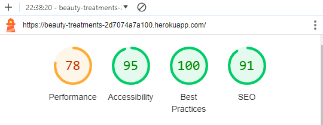

### About Page

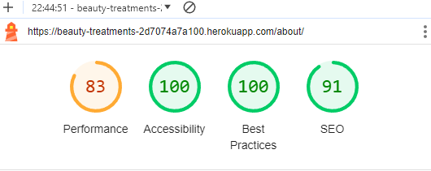

### login Page

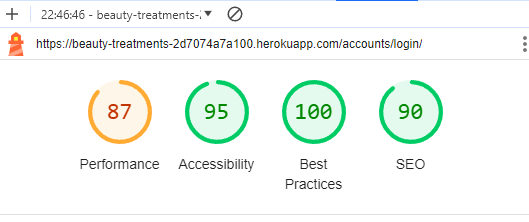

### Make Booking Page

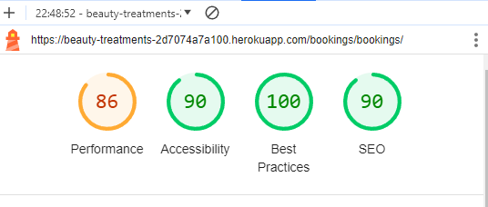

### My Bookings Page

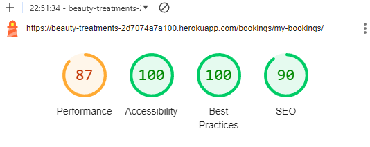

# Responsiveness

The responsiveness was checked manually by using devtools (Chrome and Edge) throughout the whole development. It was also checked with [Responsive Viewer](https://chrome.google.com/webstore/detail/responsive-viewer/inmopeiepgfljkpkidclfgbgbmfcennb/related?hl=en) Chrome extension.

### Responsive Viewer Home page

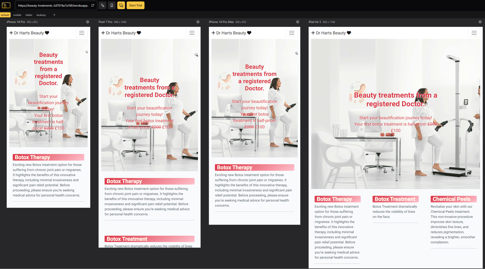

### Responsive Viewer About page

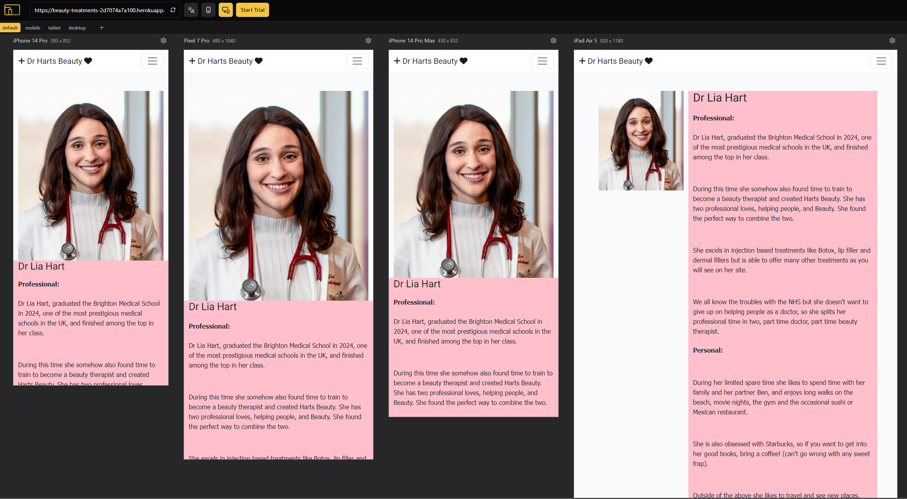

### Responsive Viewer Make bookings page

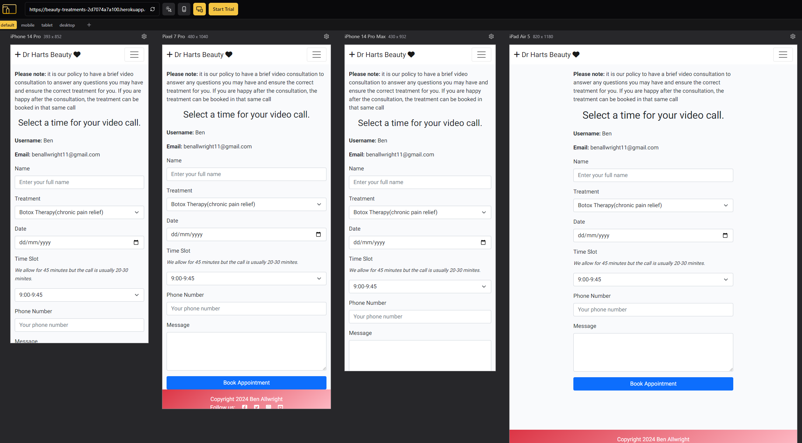

### Chrome Dev Tools mobile

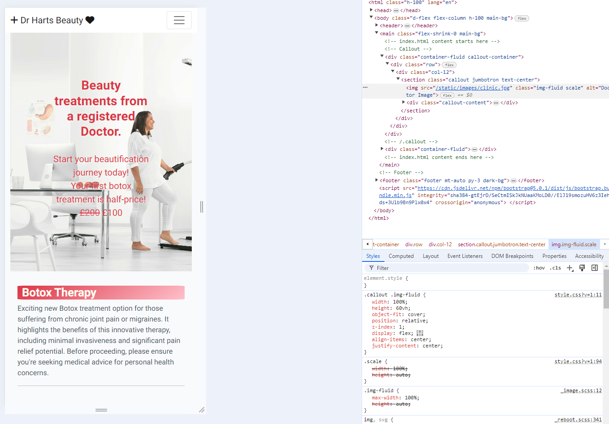

### Chrome Dev Tools Tablet

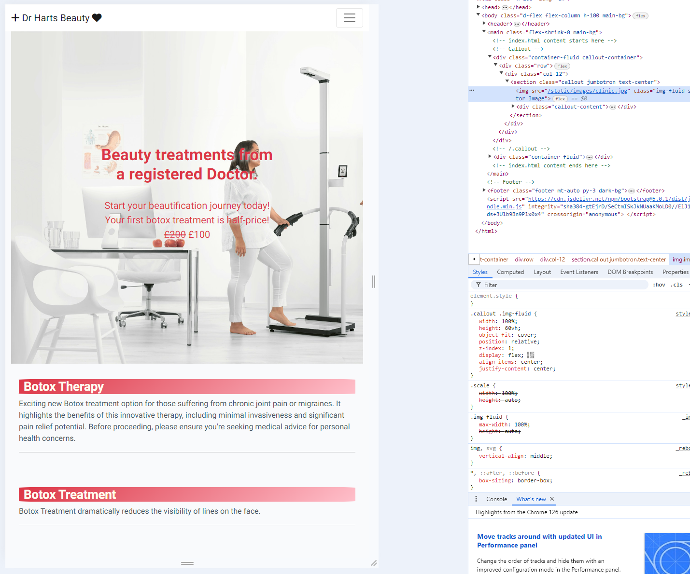

### Edge Dev Tools Tablet

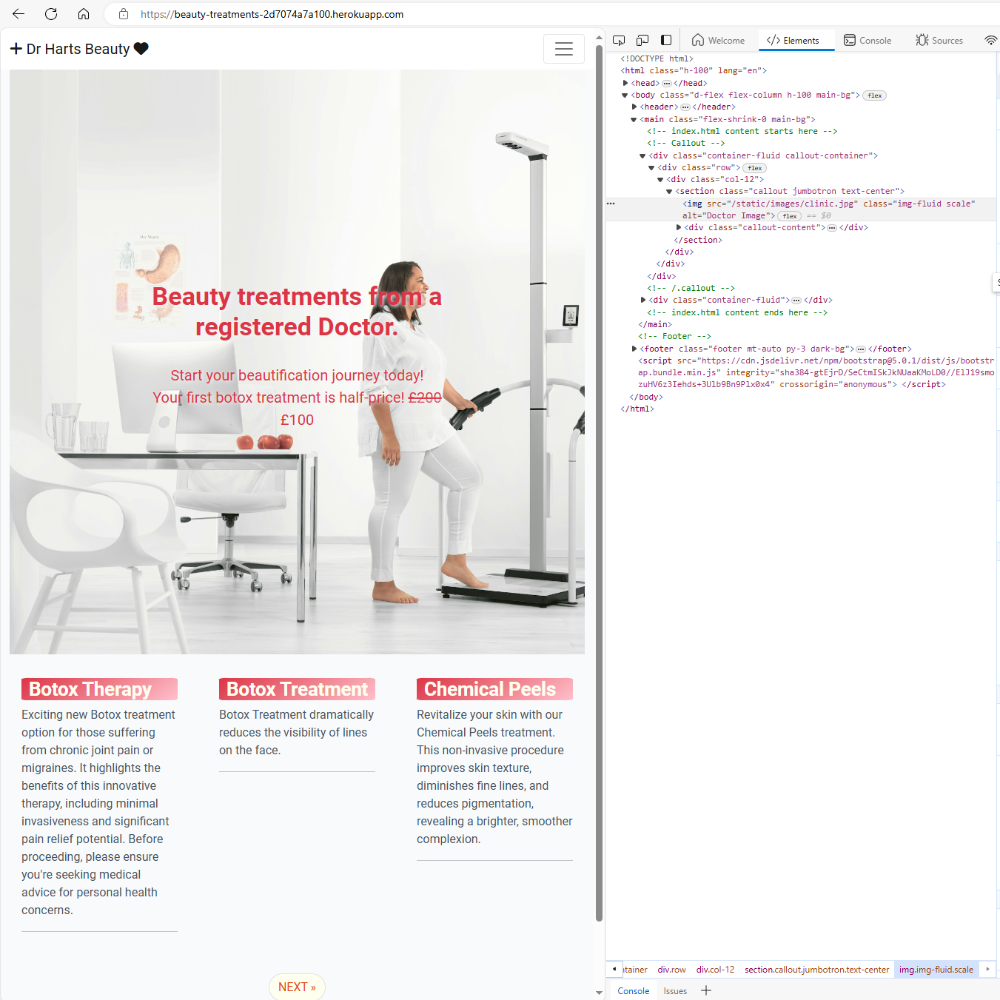

### Edge Dev Tools main

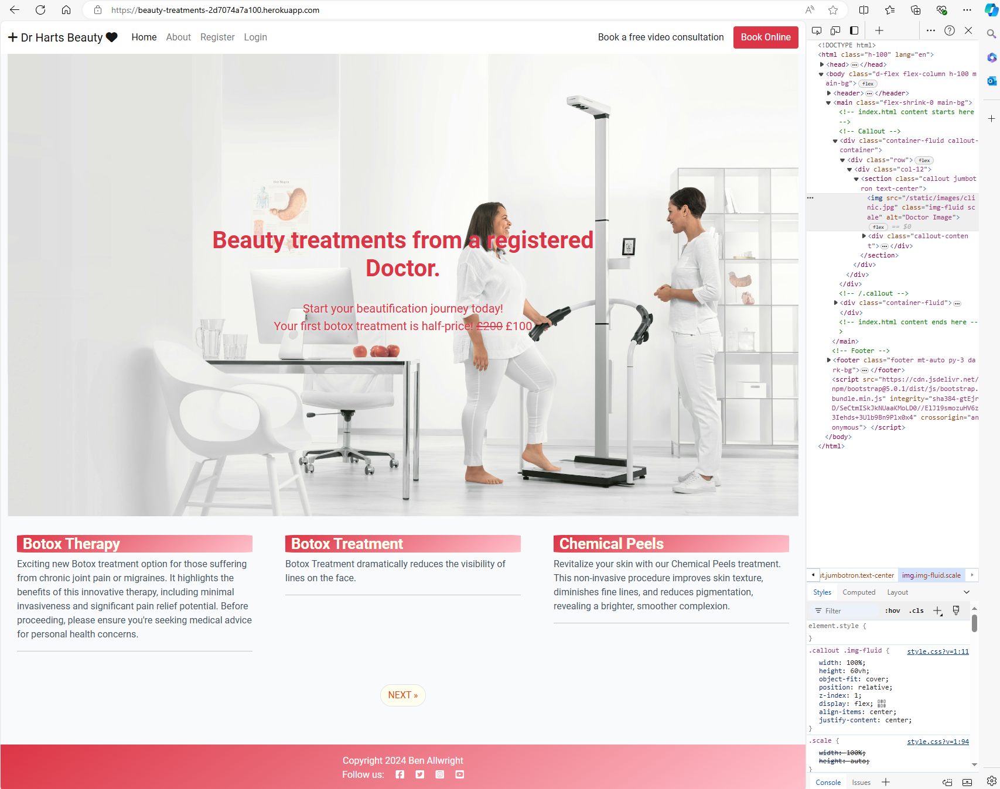

### Edge Dev Tools Mobile

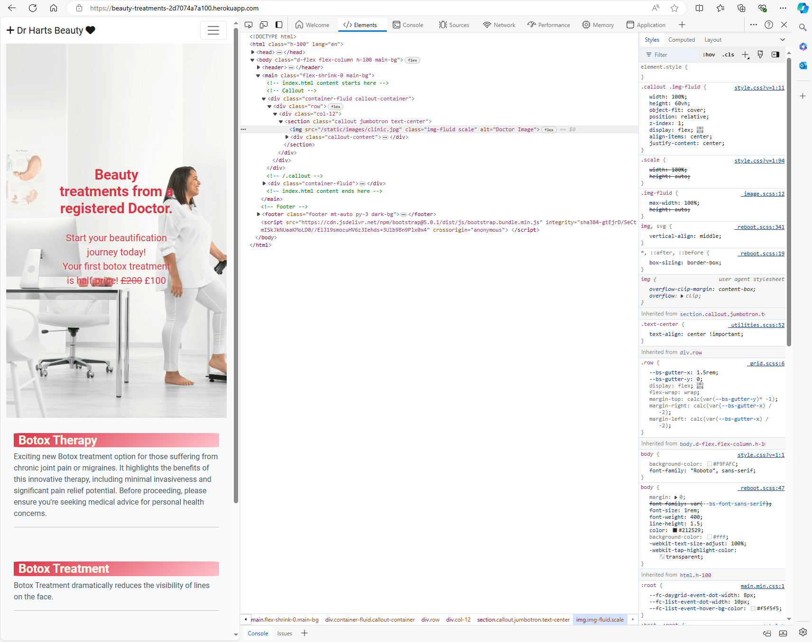